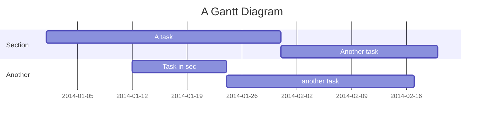

# architecture-as-code

## Diagrams

[Diagrams](https://diagrams.mingrammer.com/docs/getting-started/examples) permite que você desenhe a arquitetura do sistema de nuvem no código Python.

```python
from diagrams import Diagram
from diagrams.k8s.clusterconfig import HPA
from diagrams.k8s.compute import Deployment, Pod, ReplicaSet
from diagrams.k8s.network import Ingress, Service

with Diagram("Exposed Pod with 3 Replicas", show=False):
    net = Ingress("domain.com") >> Service("svc")
    net >> [Pod("pod1"),
            Pod("pod2"),
            Pod("pod3")] << ReplicaSet("rs") << Deployment("dp") << HPA("hpa")
```


## Mermaid

[Mermaid](https://mermaid-js.github.io/mermaid/intro/) permite criar diagramas de fluxo, sequência, Gantt, classe etc. com JavaScript. O legal é que dá pra importar no html via CDN e rodar sem precisar instalar nada.

```html
<script type="module">
    import mermaid from 'https://cdn.jsdelivr.net/npm/mermaid@9/dist/mermaid.esm.min.mjs';
    mermaid.initialize({ startOnLoad: true });
</script>

<pre class="mermaid">
sequenceDiagram
    Consumer-->API: Book something
    API-->BookingService: Start booking process
    break when the booking process fails
        API-->Consumer: show failure
    end
    API-->BillingService: Start billing process
</pre>
```


> ### Importante
> Dá pra renderizar diagramas mermaid no próprio markdown do github. É só colocar o bloco de código como sendo da linguagem `mermaid`.



## Markmap

[Markmap](https://markmap.js.org/repl) permite visualizar arquivos markdown como mapas mentais.

```markdown
---
markmap:
  colorFreezeLevel: 2
---

# markmap

## Links

- <https://markmap.js.org/>
- [GitHub](https://github.com/gera2ld/markmap)

## Related Projects

- [coc-markmap](https://github.com/gera2ld/coc-markmap)
- [gatsby-remark-markmap](https://github.com/gera2ld/gatsby-remark-markmap)

## Features

- links
- **strong** ~~del~~ *italic* ==highlight==
- multiline
  text
- `inline code`
-
    ```js
    console.log('code block');
    ```
- Katex
  - $x = {-b \pm \sqrt{b^2-4ac} \over 2a}$
  - [More Katex Examples](#?d=gist:af76a4c245b302206b16aec503dbe07b:katex.md)
- Now we can wrap very very very very long text based on `maxWidth` option
```


> ### Importante
> Dá pra usar no VSCode.


